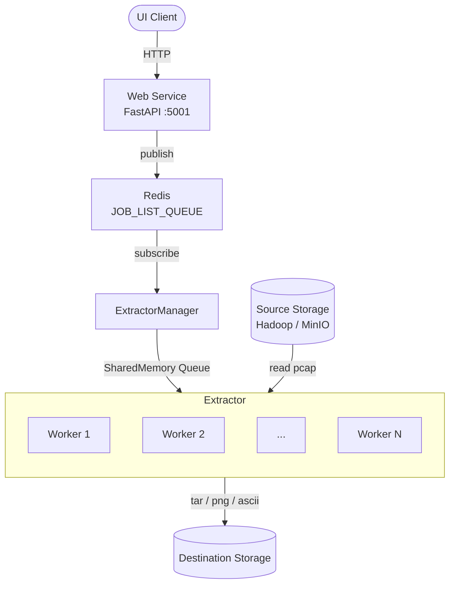
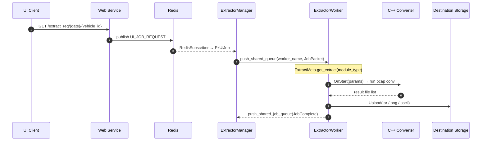

# sensor-data-extractor

자율주행 차량 멀티 센서 데이터(LiDAR / Camera / GNSS / IMU)를 수집해 정규화·추출 후 객체 스토리지로 업로드하는 분산 ETL 파이프라인.

## 개요

차량별 원본 sensor pcap을 source storage(Hadoop / MinIO)에서 받아 모듈 타입(AT128 / RSBP / AM20 / GNSS / IMU)에 따른 추출 파이프라인을 거쳐 정규화된 결과를 destination storage로 업로드한다. 단일 ExtractorManager + N개의 ExtractorWorker 가 python-library `MultiProcessManager` 의 SharedMemory 큐로 잡을 분배받아 병렬로 처리한다.

## 아키텍처



- **Web Service**: UI로부터 잡 요청 수신 → Redis에 publish
- **ExtractorManager**: 자체가 multiprocessing.Process 로 실행되며 Redis 잡 요청 수신 / 잡 큐 영속화 / worker 분배 / 회신 처리 / Slack 알림 책임을 모두 담당. 잡 분배는 sensor_type 기반(카메라 vs 그 외) round-robin.
- **ExtractorWorker (× N)**: 잡 수신 → `ExtractMeta` dispatch → sensor별 추출 → 업로드. JobComplete / ErrorNoti 는 `_shared_job_queue` 로 Manager 에 회신.
- **MultiProcessManager** ([python-library](https://github.com/Sinminbeom/python-library)): Manager + Worker N 개 lifecycle 관리. `_shared_job_queue` (worker → manager 단일 큐) + `_shared_queue[process_name]` (manager → worker per-process 큐) 를 모든 process 에 자동 inject.

## 지원 센서

| 타입 | 모델 | 처리 모듈 |
|------|------|-----------|
| LiDAR (rooftop) | Hesai AT128 (Front / Right / Rear / Left) | `At128Extract` |
| LiDAR (bumper) | RoboSense BPearl 32B (Front / Right / Rear / Left) | `RsbpExtract` |
| Camera | AM20 (10 방향) | `Am20Extract` (GStreamer) |
| GNSS | GNSS | `GnssExtract` |
| IMU | IMU | `ImuExtract` |

## 기술 스택

| 분류 | 기술 |
|------|------|
| 언어 | Python 3.14 |
| 패키지 관리 | uv |
| REST | FastAPI + uvicorn |
| IPC | Redis (pub/sub) + SharedMemory Queue |
| 공통 라이브러리 | python-library (내부) |
| 영상 디코더 | GStreamer 1.0 + DeepStream (nvv4l2decoder / nvvideoconvert) |
| 네이티브 변환기 | C++ (AT128 / RSBP / IMU converter, pybind11) |
| 린팅 / 포맷 | ruff |
| 타입 체크 | pyright |
| 테스트 | pytest |

## 디렉터리 구조

```
sensor-data-extractor/
├── conf/
│   ├── application.conf            # 운영 설정 (Redis / Hadoop / MinIO / Process)
│   └── logging.conf
├── src/
│   ├── app/
│   │   ├── extractor/process/      # ExtractorManager + ExtractorWorker
│   │   ├── web_service/            # FastAPI web service + process (uvicorn)
│   │   └── app_object.py           # MultiProcessManagerApp / FromCate
│   ├── common/process/             # AppProcess (logger/config init)
│   ├── config/                     # ProjectConfig / RedisConfig
│   ├── consumer/                   # MessageConsumer / BulkMessageConsumer / ConsumerRegistry (큐 watch thread)
│   ├── define/                     # module_type / vehicle_id
│   ├── drivers/                    # 차량/sensor driver + native C++ source + vendor SDK 가 sensor 별 co-locate
│   │   ├── driver.py               # IDriver / IHardware 인터페이스
│   │   ├── drivers.py              # DriverRegistry
│   │   ├── vehicles.py             # VehicleRegistry
│   │   ├── am20/                   # GStreamer pipeline native source (Python wrapper 없음)
│   │   │   ├── am20_converter.cpp
│   │   │   └── CMakeLists.txt
│   │   ├── at128/                  # Hesai LiDAR driver + native source + HesaiLidar_SDK_2.0 + 보정 데이터
│   │   ├── rsbp/                   # RoboSense LiDAR driver + native source + rs_driver SDK
│   │   └── imu/                    # Novatel GNSS/IMU driver + native source + novatel_edie SDK + messages_public.json
│   ├── extractor/
│   │   ├── extract.py              # IExtract 인터페이스
│   │   ├── extract_context.py      # ExtractContext (단일 잡 컨텍스트 dataclass)
│   │   ├── gstreamer/              # GStreamer pipeline 래퍼 (AM20 카메라용) + state + cpp_library
│   │   └── sensors/                # AT128 / RSBP / AM20 / GNSS / IMU 추출기 (staticmethod 기반)
│   ├── messaging/                  # RedisPublisher / RedisSubscriber / SlackMessageSender (thread 기반)
│   ├── task/                       # TaskRegistry / TaskRunner / TaskTree / VehicleJobGroup / JobBatch (Composite 패턴) + RedisJobListStore
│   ├── pcap/                       # PCAP binary parser (file_header / packet_header / body / element_buffer / message_buffer)
│   │   ├── body/                   # Ethernet / Linux SLL / Linux SLL V2 본문 parser
│   │   ├── filter/                 # AT128 / Bpearl filter
│   │   ├── header/                 # PcapFileHeader / PcapPacketHeader
│   │   ├── reader/                 # LocalStorageReader / ObjectStorageReader
│   │   └── sensor/                 # At128PayloadData / BpearlPayloadData
│   ├── process_category/           # EXTRACTOR / WEB_SERVICE 카테고리 등록
│   ├── protocol/                   # BaseProtocol / JobPacket / JobComplete / ErrorNoti / PkUiJob / ProtocolMeta / ProtocolHandler
│   ├── sensor_category/            # sensor enum + sensor_id ↔ category 매핑 + SensorRegistry
│   ├── utils/                      # JsonUtil / ShellUtil / RedisWrapper / TimeStringFit / CollectionUtils / DockerComposeGenerator
│   ├── extractor_app.py            # extractor 진입점
│   └── web_service_app.py          # web service 진입점
├── scripts/                        # 운영 launcher (.sh) — at128 / rsbp / gnss
├── tools/                          # 사전 빌드된 CLI 바이너리 (pcl_tool / rs_driver_pcdsaver / converter_file_parser) + cuda/
└── pyproject.toml
```

## 사전 요구사항

- Python 3.14+
- [uv](https://docs.astral.sh/uv/) 설치
- Redis 서버 실행 (기본: `localhost:6379`)
- python-library (storage / logger / process / configure 등 공통 인프라 제공)
- GStreamer 1.0 + DeepStream (카메라 추출용, NVIDIA GPU 필요)
- C++ 네이티브 변환기 빌드 산출물 (`*.so`)

## 스토리지 설정

원본 pcap (`SRC_STORAGE`) / 추출 결과 (`DST_STORAGE`) 두 종류를 `conf/application.conf` 에서 설정한다.

```ini
[SRC_STORAGE]
ROOT = /oncx-dev-common-assets-bucket/test/split

[DST_STORAGE]
ROOT = /oncx-dev-common-assets-bucket/test/extracted
```

| 필드 | 설명 |
|------|------|
| `ROOT` | python-library `S3StorageClient` 내부 path 규약 (`/bucket/key`, 반드시 `/` 시작). worker/task_runner/server가 그대로 prefix로 사용 |

storage 구현체는 S3로 하드코딩 (worker / task_runner / server / am20_extract 가 직접 `S3StorageFactory` 로 인스턴스화). 내부적으로 [python_library.storage.S3Storage](https://github.com/Sinminbeom/python-library) (`IStorage` 인터페이스) 를 통해 read/write/upload/get_file_list 한다.

## 설치

```bash
git clone git@github.com:Sinminbeom/sensor-data-extractor.git
cd sensor-data-extractor
uv sync --dev
```

## Native 빌드

각 sensor 의 C++ converter (pybind11) 와 GStreamer pipeline 은 사전에 빌드되어 있어야 한다. Python 측 (`extractor.gstreamer.cpp_library`, `drivers.{at128,rsbp,imu}.pcd_conv`) 가 빌드 산출물 `*.so` 를 런타임에 load.

| 모듈 | 소스 | 빌드 산출물 (예상 경로) | 의존 |
|------|------|-----------------------|------|
| AM20 (camera, GStreamer) | [src/drivers/am20/am20_converter.cpp](src/drivers/am20/am20_converter.cpp) | `src/drivers/am20/libam20_converter.so` | GStreamer 1.0 + DeepStream (NVIDIA GPU), pybind11 |
| AT128 (Hesai LiDAR) | [src/drivers/at128/at128_converter.cpp](src/drivers/at128/at128_converter.cpp) | `src/drivers/at128/at128_converter.so` | [HesaiLidar_SDK_2.0](src/drivers/at128/HesaiLidar_SDK_2.0) 포함, pybind11 |
| RSBP (RoboSense LiDAR) | [src/drivers/rsbp/rsbp_converter.cpp](src/drivers/rsbp/rsbp_converter.cpp) | `src/drivers/rsbp/rsbp_converter.so` | [rs_driver](src/drivers/rsbp/rs_driver) 포함, pybind11 |
| IMU (Novatel GNSS) | [src/drivers/imu/imu_converter.cpp](src/drivers/imu/imu_converter.cpp) | `src/drivers/imu/imu_converter.so` | [novatel_edie](src/drivers/imu/novatel_edie) 포함, pybind11 |
| CUDA point cloud merge | [tools/cuda/cuda_transform.cu](tools/cuda/cuda_transform.cu) | `tools/cuda/cuda_transform.so` | CUDA toolkit (Makefile 빌드) |

빌드 (CMake):
```bash
cd src/drivers/<module>
cmake -B build && cmake --build build
```

CUDA 빌드:
```bash
cd tools/cuda && make
```

LiDAR 추출에 필요한 보정 데이터는 sensor 모듈 내부에 동봉:
- [src/drivers/at128/correction/](src/drivers/at128/correction) — Hesai AT128 angle/firetime correction
- [src/drivers/at128/params/](src/drivers/at128/params) — RoboSense params
- [src/drivers/imu/messages_public.json](src/drivers/imu/messages_public.json) — Novatel 메시지 DB (GNSS 추출 시 사용)

## 실행

```bash
# 1. Extractor (manager + worker N개)
uv run python src/extractor_app.py

# 2. Web Service (잡 발행 API)
uv run python src/web_service_app.py
```

## Docker Compose 생성

`conf/application.conf` 의 `VOLUMES_PLACEHOLDER` 값을 기반으로 docker-compose.yml의 volume mount 라인을 동적으로 생성한다.

```bash
uv run python src/utils/docker_compose_generator.py
```

## 메시지 흐름 요약



## 개발

```bash
uv run ruff check . --fix
uv run ruff format .
uv run pyright
uv run pytest
```

## 외부 의존성

본 저장소는 인프라 라이브러리(PCAP / MessageQueue / Protocol / Handler / Task / Messaging) 를 모두 자체 모듈로 구성하고, 스토리지는 `python-library` 의 `IStorage` 추상화를 사용한다. 외부 의존성은:

| 항목 | 비고 |
|------|------|
| Vendor LiDAR SDK | [HesaiLidar_SDK_2.0](src/drivers/at128/HesaiLidar_SDK_2.0), [rs_driver](src/drivers/rsbp/rs_driver), [novatel_edie](src/drivers/imu/novatel_edie) — 각 sensor 모듈에 포함. 빌드 시 link |
| GStreamer | `gi.repository.Gst` (DeepStream) — `nvv4l2decoder` / `nvvideoconvert`. NVIDIA GPU + DeepStream SDK 필요 |
| pybind11 | C++ converter 들이 Python module 로 노출되는 데 사용 |
| CUDA toolkit | [tools/cuda/](tools/cuda) point cloud merge 빌드용 (선택) |
| python-library `storage.S3Storage` | 유일한 storage 구현체. worker / task_runner / server / am20_extract 가 `S3StorageFactory` 로 직접 인스턴스화 |
